<h1 align="center">
IntelliPresenceSync
</h1>

<p align="center">

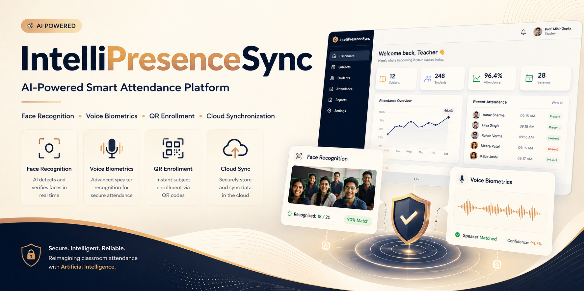

</p>


<h3 align="center">
AI-Powered Smart Attendance Platform for Modern Classrooms
</h3>

<p align="center">
Face Recognition • Voice Biometrics • QR Enrollment • Cloud Synchronization
</p>

<p align="center">

<a href="LANDING_WEBSITE_URL">

</a>

<a href="STREAMLIT_APP_URL">

</a>

<a href="GITHUB_REPOSITORY">

</a>

<a href="DEMO_VIDEO_URL">

</a>

</p>

<p align="center">


</p>

---

<p align="center">

</p>

---

## 📑 Table of Contents

- Overview
- Why IntelliPresenceSync?
- IntelliPresenceSync Ecosystem
- Project Highlights
- Core Features
- Live Demonstration
- Project Walkthrough
- Screenshot Gallery
- System Architecture
- AI Workflow
- Technology Stack
- Installation
- Roadmap
- Author

---

# 📖 Overview

**IntelliPresenceSync** is an end-to-end AI-powered attendance management ecosystem designed to modernize classroom attendance using intelligent biometric verification.

Instead of relying on traditional roll calls, the platform combines **Computer Vision**, **Voice Biometrics**, and **Cloud Synchronization** to automate attendance with speed, accuracy, and reliability.

The project consists of two fully integrated applications working together as a unified ecosystem.

- 🌐 **Landing Dashboard (Flask)** — A professional product website showcasing the platform, technology, workflow, and providing seamless navigation to the AI application.

- 🤖 **AI Attendance System (Streamlit)** — An interactive attendance platform where teachers manage classrooms, students enroll, and AI-powered face and voice verification automatically records attendance.

Together, they create a complete AI attendance ecosystem suitable for educational institutions, research demonstrations, and production-ready portfolio projects.

---

# ❓ Why IntelliPresenceSync?

Traditional attendance systems introduce several inefficiencies that affect both educators and students.

| Traditional Approach | IntelliPresenceSync |
|----------------------|--------------------|
| Manual roll calls | AI-powered attendance |
| Proxy attendance | Biometric verification |
| Time-consuming process | Instant recognition |
| Manual record keeping | Cloud synchronization |
| Limited automation | End-to-end intelligent workflow |

Students complete a one-time biometric registration using their **face** and **voice**.

Teachers can later verify classroom attendance using:

- 📸 Classroom photographs
- 🎙️ Sequential voice recordings

Attendance records are automatically synchronized to **Supabase PostgreSQL**, providing secure cloud storage and centralized attendance management.

---

# 🚀 IntelliPresenceSync Ecosystem

```text
                    IntelliPresenceSync

                    Landing Dashboard
                 (Flask + HTML + CSS + JS)
                           │
                           ▼
                 AI Attendance Platform
                     (Streamlit)
                 ┌─────────┴─────────┐
                 ▼                   ▼
        Face Recognition      Voice Biometrics
                 │                   │
                 └─────────┬─────────┘
                           ▼
                  Supabase PostgreSQL
                           │
                           ▼
                 Attendance Records & Reports
```

---

# ✨ Project Highlights

- ✅ End-to-End AI Attendance Ecosystem
- ✅ Dual Biometric Verification
- ✅ Face Recognition using Computer Vision
- ✅ Voice Biometrics using Deep Learning
- ✅ Dynamic QR-Based Student Enrollment
- ✅ Secure Supabase Cloud Integration
- ✅ Teacher & Student Management Portals
- ✅ Interactive Attendance Dashboard
- ✅ Fully Responsive User Interface
- ✅ Professional Flask Landing Dashboard
- ✅ Streamlit-Based AI Console
- ✅ Modern Modular Architecture

---

# ⭐ Core Features

| Feature | Description |
|----------|-------------|
| 📸 **Face Recognition** | Recognize multiple students from a classroom photograph using facial embeddings and machine learning classification. |
| 🎙️ **Voice Biometrics** | Identify registered students using deep-learning speaker embeddings and similarity matching. |
| 📲 **QR Enrollment** | Enroll students instantly using dynamic QR codes or invitation links. |
| 👨‍🏫 **Attendance Management** | Manage subjects, attendance records, classroom sessions, and reports through an intuitive dashboard. |
| ☁️ **Cloud Synchronization** | Securely synchronize attendance records, biometric embeddings, and student information with Supabase PostgreSQL. |
| 📱 **Responsive Design** | Optimized user experience across desktops, tablets, and mobile devices. |
| 🔒 **Secure Authentication** | Password hashing with bcrypt and secure cloud-based data management. |

---

# 🎥 Live Demonstration

| Resource | Link |
|-----------|------|
| 🌐 Landing Dashboard | LANDING_WEBSITE_URL |
| 🤖 AI Attendance Platform | STREAMLIT_APP_URL |
| 🎥 Project Demo | DEMO_VIDEO_URL |
| 📂 GitHub Repository | GITHUB_REPOSITORY |

---

<p align="center">

</p>

---

# 🎬 Project Walkthrough

The walkthrough demonstrates the complete IntelliPresenceSync ecosystem from student registration to AI-powered attendance verification.

### Demonstration Flow

- 🌐 Landing Dashboard
- 👨‍🎓 Student Registration
- 📲 Subject Enrollment
- 👩‍🏫 Teacher Dashboard
- 📸 Face Recognition Attendance
- 🎙️ Voice Biometric Attendance
- 📊 Attendance Reports
- ☁️ Cloud Synchronization

---

# 📸 Screenshot Gallery

Explore the complete IntelliPresenceSync ecosystem through the following screenshots, covering the landing dashboard, student workflow, teacher workflow, and AI-powered attendance system.

---

# 🌐 Landing Dashboard

The **Landing Dashboard** serves as the public-facing website of IntelliPresenceSync. It introduces the platform, explains its capabilities, showcases the underlying AI technologies, and provides a seamless gateway to the AI-powered attendance application.

From understanding the motivation behind the project to exploring the complete technology stack, the dashboard offers a comprehensive overview before users launch the attendance system.

---

## 🏠 Home

<p align="center">

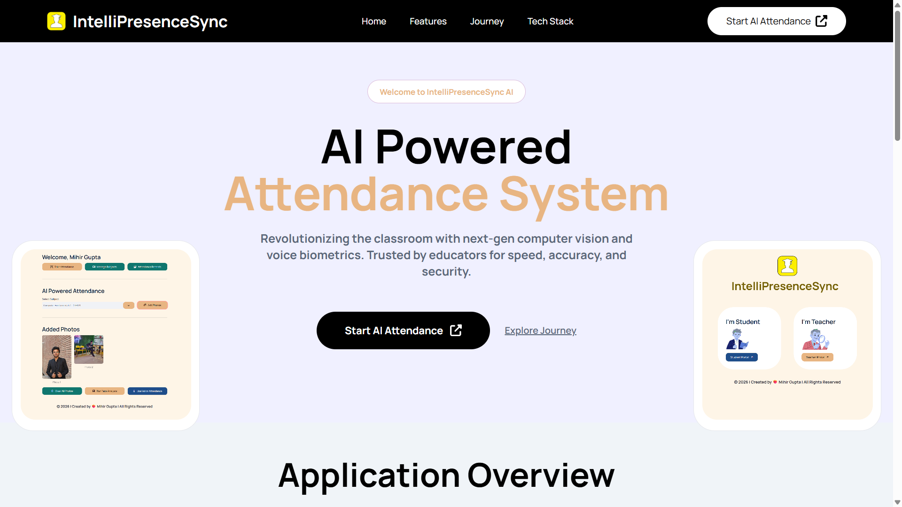

</p>

---

## 📖 Application Overview

<p align="center">

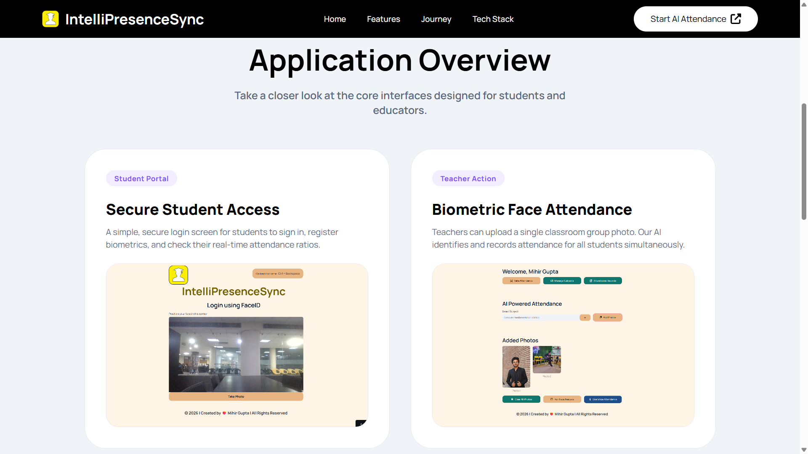

</p>

---

## ✨ Innovative Features

<p align="center">

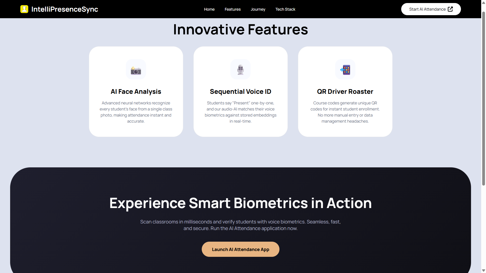

</p>

---

## 🚀 User Journey

<p align="center">

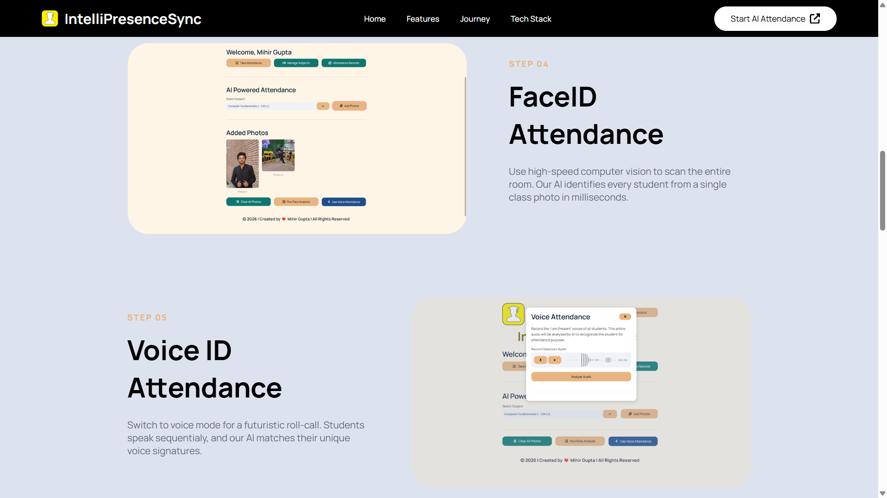

</p>

---

## 🛠 Technology Stack

<p align="center">

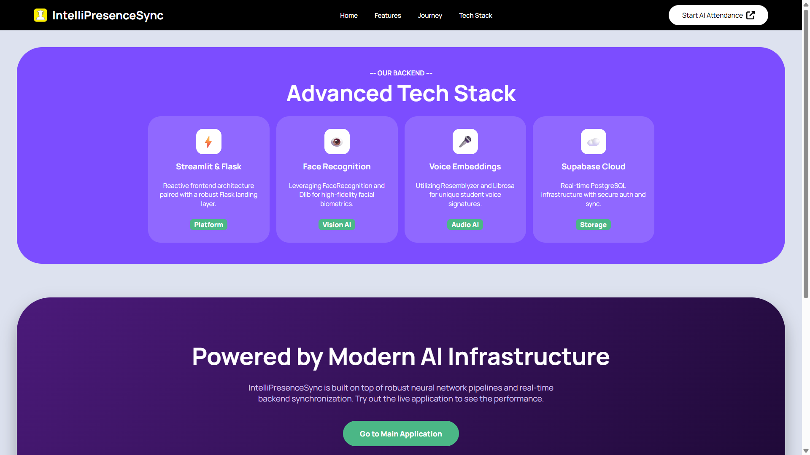

</p>

---

# 👨‍🎓 Student Workflow

Students complete a **one-time enrollment process** by registering their profile, selecting subjects, and securely storing their biometric information. Once enrolled, attendance can be verified using AI without requiring repeated registrations.

---

## Step 1 — Student Login

<p align="center">

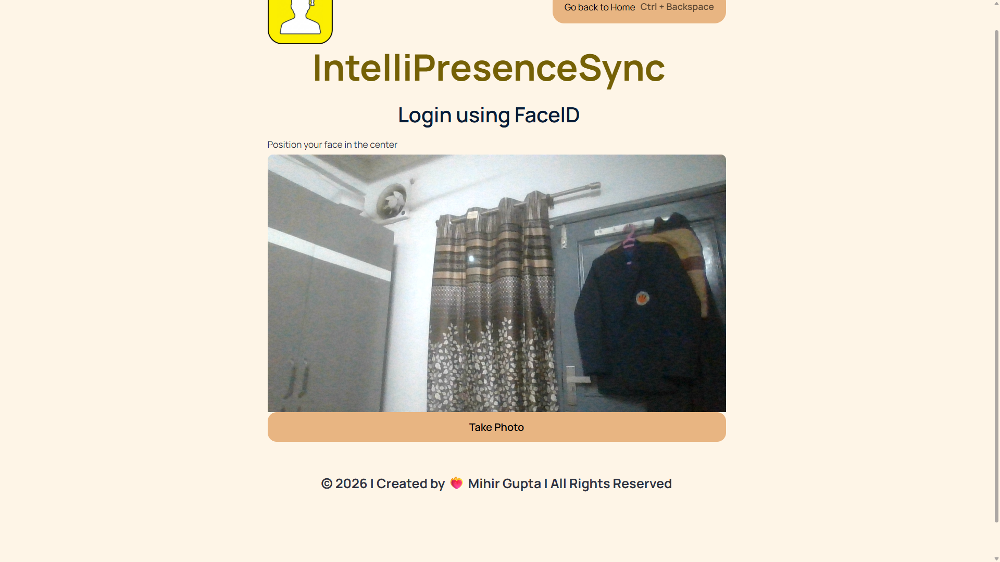

</p>

---

## Step 2 — Subject Enrollment

<p align="center">

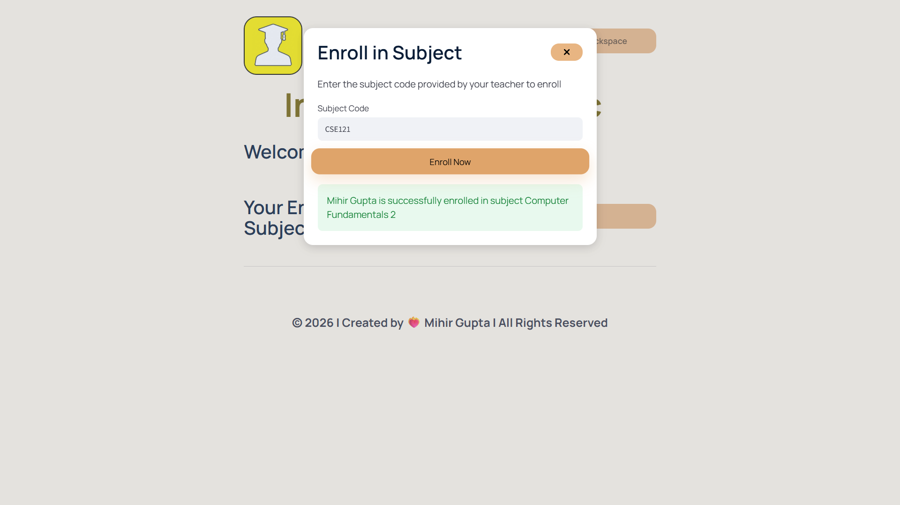

</p>

---

## Step 3 — Student Dashboard

<p align="center">

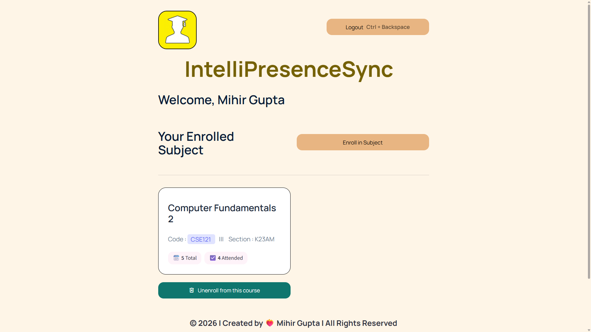

</p>

---

# 👩‍🏫 Teacher Workflow

Teachers can efficiently manage classrooms, create subjects, share enrollment links, perform attendance using Face Recognition or Voice Biometrics, and monitor attendance history from a centralized dashboard.

---

## Step 1 — Teacher Login

<p align="center">

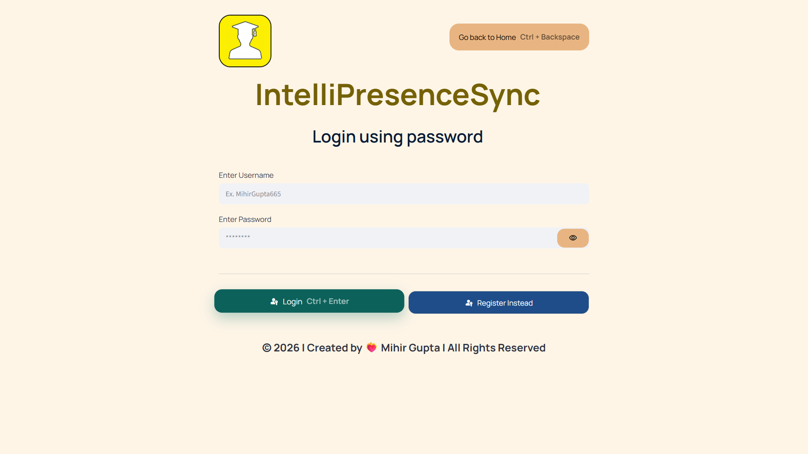

</p>

---

## Step 2 — Teacher Dashboard

<p align="center">

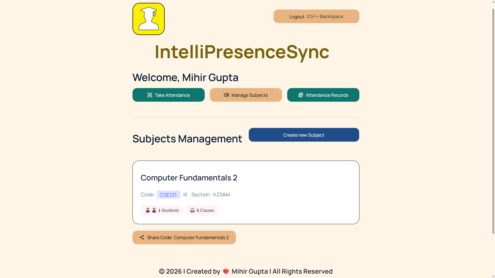

</p>

---

## Step 3 — Create Subject

<p align="center">

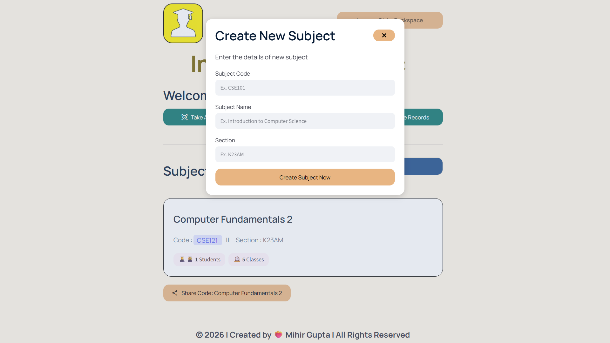

</p>

---

## Step 4 — Share QR Code / Invite Link

<p align="center">

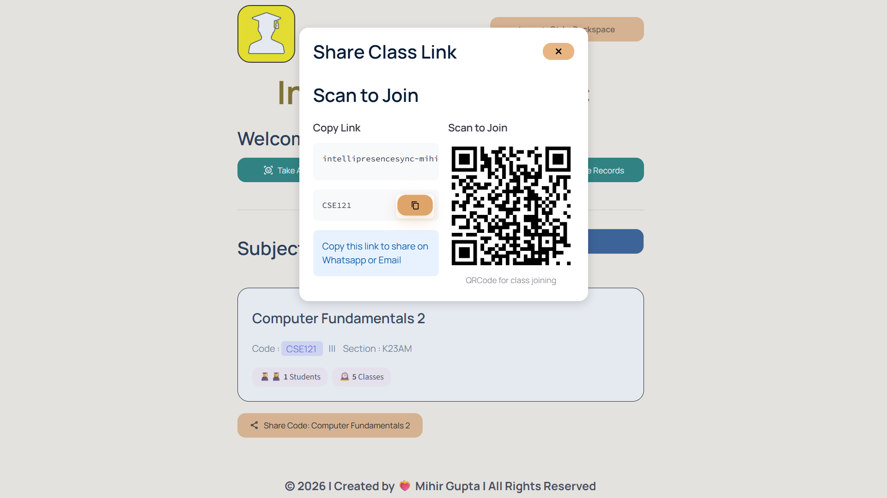

</p>

---

## Step 5 — Voice Attendance

<p align="center">

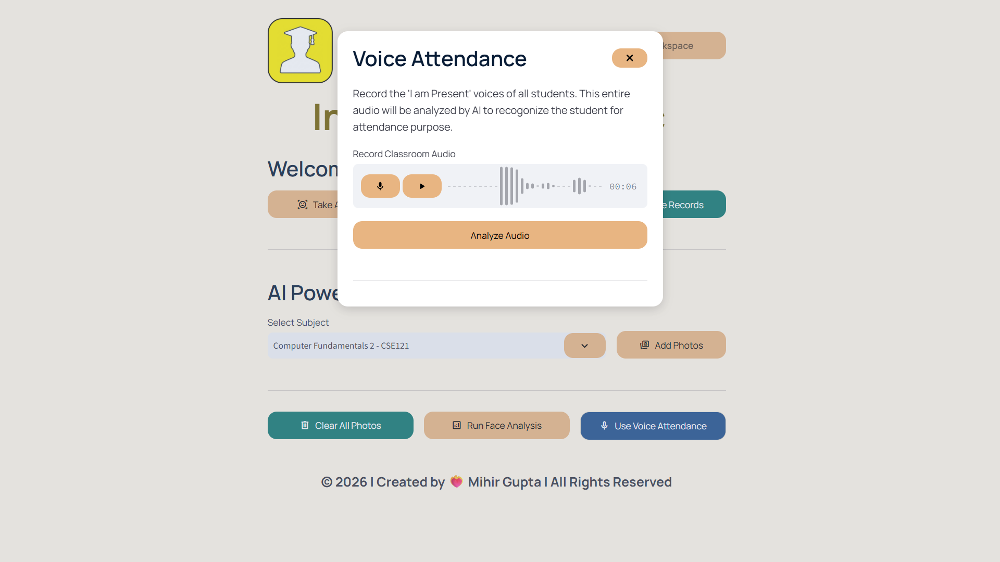

</p>

---

## Step 6 — Face Recognition Attendance

<p align="center">

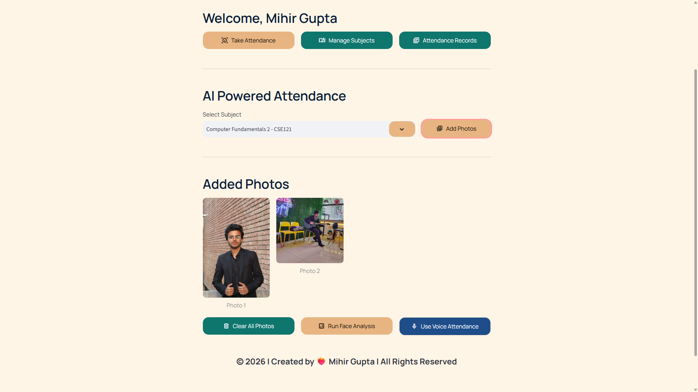

</p>

---

## Step 7 — Attendance Records

<p align="center">

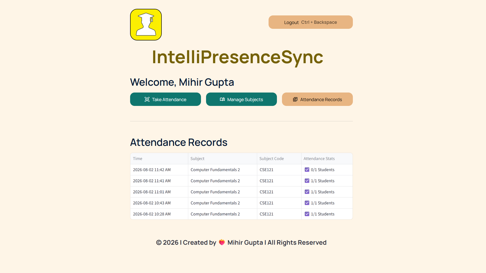

</p>

---

# 🏗 System Architecture

The IntelliPresenceSync ecosystem is composed of two interconnected applications backed by a centralized cloud database.

The **Landing Dashboard** introduces the platform and routes users to the **AI Attendance System**, where biometric verification and attendance management take place.

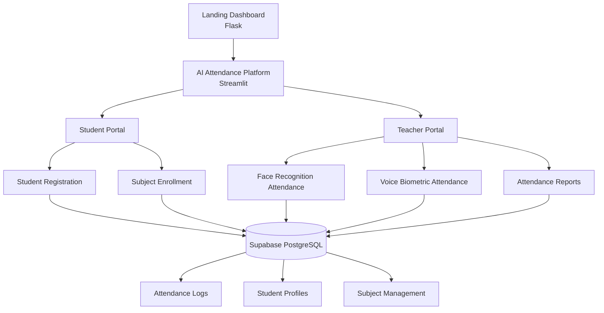

---

# 🤖 AI Attendance Workflow

IntelliPresenceSync combines **Computer Vision** and **Voice Biometrics** to create a secure dual-biometric attendance system.

Students register once by providing facial and voice samples.

During attendance, teachers can choose either verification pipeline depending on the classroom scenario.

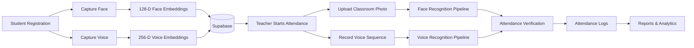

---

# 🛠 Technology Stack

| Category | Technologies |
|------------|--------------|
| **Programming Language** | Python |
| **Landing Dashboard** | Flask, HTML5, CSS3, JavaScript |
| **AI Attendance Platform** | Streamlit |
| **Computer Vision** | dlib, face_recognition_models, Scikit-Learn |
| **Voice Biometrics** | Resemblyzer, Librosa |
| **Cloud Database** | Supabase PostgreSQL |
| **Authentication** | bcrypt |
| **QR Generation** | Segno |
| **Image Processing** | Pillow |
| **Deployment** | Vercel, Streamlit Community Cloud |
| **Version Control** | Git & GitHub |

---

# 🧠 Artificial Intelligence Pipeline

## 📸 Face Recognition

- Face Detection
- Facial Landmark Localization
- 128-Dimensional Face Embeddings
- SVM Classification
- Multi-Student Identification

---

## 🎙 Voice Biometrics

- Voice Recording
- Audio Normalization
- Silence-Based Audio Segmentation
- 256-Dimensional Speaker Embeddings
- Cosine Similarity Matching

---

## ☁ Cloud Infrastructure

- Supabase PostgreSQL
- Attendance Storage
- Student Management
- Subject Management
- Cloud Synchronization
- Secure Authentication

---

# 📌 System Modules

| Module | Purpose |
|----------|----------|
| 🌐 Landing Dashboard | Product website and application gateway |
| 👨‍🎓 Student Portal | Registration, enrollment and student dashboard |
| 👩‍🏫 Teacher Portal | Attendance management and classroom administration |
| 📸 Face Recognition Engine | AI-powered classroom image verification |
| 🎙 Voice Recognition Engine | Deep-learning speaker identification |
| ☁ Cloud Database | Centralized storage using Supabase PostgreSQL |
| 📊 Attendance Reports | Attendance history and classroom analytics |

---

# 📂 Repository Structure

IntelliPresenceSync follows a modular architecture consisting of two independent applications that work together as a unified AI-powered attendance ecosystem.

```text
IntelliPresenceSync
│
├── Landing Dashboard
│   ├── app.py
│   ├── templates/
│   ├── static/
│   │   ├── css/
│   │   ├── img/
│   │   ├── hero.gif
│   │   └── demo-video.mp4
│   └── README.md
│
├── AI Attendance System
│   ├── app.py
│   ├── src/
│   │   ├── components/
│   │   ├── database/
│   │   ├── pipelines/
│   │   ├── screens/
│   │   └── ui/
│   ├── requirements.txt
│   └── README.md
│
└── Cloud Backend
    └── Supabase PostgreSQL
```

---

# 🚀 Getting Started

## Prerequisites

Before running IntelliPresenceSync locally, ensure the following are installed:

- Python 3.10+
- Git
- Streamlit
- Flask

---

## Clone Repository

```bash
git clone https://github.com/mihirgupta665/IntelliPresenceSync.git

cd IntelliPresenceSync
```

---

## Create Virtual Environment

```bash
python -m venv venv
```

### Windows

```bash
venv\Scripts\activate
```

### macOS / Linux

```bash
source venv/bin/activate
```

---

## Install Dependencies

### AI Attendance System

```bash
pip install -r requirements.txt
```

### Landing Dashboard

```bash
pip install -r requirements.txt
```

---

## Configure Environment Variables

Create a `.env` file.

```env
SUPABASE_URL=YOUR_SUPABASE_URL

SUPABASE_KEY=YOUR_SUPABASE_ANON_KEY
```

---

## Launch Landing Dashboard

```bash
python app.py
```

Visit

```
http://127.0.0.1:5002
```

---

## Launch AI Attendance Platform

```bash
streamlit run app.py
```

---

# 🌍 Deployment

| Component | Platform |
|-----------|----------|
| 🌐 Landing Dashboard | Vercel |
| 🤖 AI Attendance Platform | Streamlit Community Cloud |
| ☁️ Database | Supabase PostgreSQL |

---

# 🛣 Roadmap

### Completed

- ✅ AI Face Recognition Attendance
- ✅ Voice Biometric Attendance
- ✅ QR-Based Student Enrollment
- ✅ Teacher Dashboard
- ✅ Student Dashboard
- ✅ Attendance Reports
- ✅ Cloud Synchronization
- ✅ Responsive User Interface
- ✅ Professional Landing Website

### Planned

- ⬜ Face Anti-Spoofing
- ⬜ Liveness Detection
- ⬜ Mobile Application
- ⬜ REST API
- ⬜ Docker Support
- ⬜ CI/CD Pipeline
- ⬜ Multi-Camera Attendance
- ⬜ Classroom Analytics Dashboard
- ⬜ Email Notifications
- ⬜ Parent Portal
- ⬜ Classroom Heatmaps
- ⬜ Multi-Institution Support

---

# 💡 Key Learnings

Building IntelliPresenceSync provided hands-on experience in designing and deploying an end-to-end Artificial Intelligence application.

Some of the major areas explored throughout the project include:

- Computer Vision
- Speaker Recognition
- Machine Learning
- Audio Processing
- Full Stack Development
- Cloud Database Design
- Streamlit Application Development
- Flask Web Development
- Responsive UI Design
- Cloud Deployment
- Modular Software Architecture

---

# 🙏 Acknowledgements

IntelliPresenceSync was made possible by the incredible open-source ecosystem.

Special thanks to:

- Streamlit
- Flask
- Supabase
- Scikit-Learn
- Dlib
- face_recognition_models
- Resemblyzer
- Librosa
- Pillow
- Segno

Their amazing work made this project possible.

---

# 👨‍💻 Author

<div align="center">

## Mihir Gupta

AI & Machine Learning Engineer

Full Stack Developer

Building intelligent software solutions powered by Artificial Intelligence.

</div>

<p align="center">

<a href="https://github.com/mihirgupta665">

</a>

<a href="YOUR_LINKEDIN_URL">

</a>

<a href="YOUR_PORTFOLIO_URL">

</a>

<a href="mailto:YOUR_EMAIL">

</a>

</p>

---

# ⭐ Show Your Support

If you found this project interesting or useful, consider giving the repository a ⭐.

Your support helps increase the visibility of the project and encourages future development.

---

# 📜 License

This project is licensed under the **MIT License**.

Feel free to use, learn from, and build upon this project in accordance with the license.

---

<div align="center">

# IntelliPresenceSync

### Reimagining Classroom Attendance with Artificial Intelligence

**Face Recognition • Voice Biometrics • QR Enrollment • Cloud Synchronization**

<br>

**Built with Python, Artificial Intelligence, and a passion for creating smarter educational technology.**

</div>