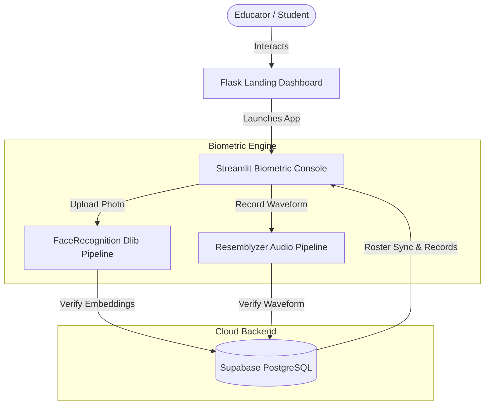

# IntelliPresenceSync 📸 🎙️

[](https://flask.palletsprojects.com/)
[](https://streamlit.io/)
[](https://supabase.com/)
[](https://www.python.org/)
[](https://github.com/ageitgey/face_recognition)
[](https://github.com/resemble-ai/Resemblyzer)

> **IntelliPresenceSync** is a premium, next-generation classroom attendance auditing platform that replaces manual roll calls with advanced biometrics. Powered by high-speed Computer Vision (Face ID) and Deep Learning Audio Biometrics (Voice ID), it provides educators with an instant, tamper-proof verification dashboard.

---

## 🌟 Key Features

*   **📸 AI Face Recognition**: Upload a single classroom photo to scan the entire room. Neural networks process facial biometrics and map them to registered student databases in milliseconds.
*   **🎙️ Sequential Voice ID**: Students check in by saying *"Present"* one by one. Our audio analysis pipeline matches voice embeddings against stored signatures in real-time.
*   **📲 QR Driver Roster**: Generates session-specific dynamic QR codes for rapid student onboarding. Eliminates manual database creation.
*   **📊 Live Analytics Dashboard**: Review historical attendance streams, track individual streaks, check verification confidence scores, and export Excel/CSV reports instantly.
*   **🔒 Secure Cloud Sync**: Integrates with robust backend databases using real-time synchronization, ensuring logs are preserved securely.

---

## 🛠️ Technology Stack & Tools

### **1. Core Platform & User Interfaces**
*   **Flask (Python)**: Drives the ultra-fast landing page system, routing users through dynamic marketing pathways and orchestrating layouts.
*   **Streamlit**: Powers the interactive web console where educators process real-time voice roll-calls, upload files, and review roster metrics.
*   **HTML5, Vanilla CSS3, & JS**: Clean, responsive layout utilizing modern grid/flex architectures, custom hover transitions, CSS variable-based design systems, and mobile hamburger navigation overrides.

### **2. Artificial Intelligence & Biometric Pipelines**
*   **Face_Recognition (Dlib)**: A deep-learning model built with state-of-the-art face detection and alignment algorithms. Evaluates 128-dimension vector embeddings to identify students from a single picture.
*   **Resemblyzer**: Utilizes a deep-learning model to extract high-level audio features, comparing speaker vocal signatures against registered voice templates.
*   **Librosa**: Powers the audio preprocessing pipeline by cleaning waveforms, trimming silence, and preparing raw voice samples for deep learning.

### **3. Backend Infrastructure & Storage**
*   **Supabase (PostgreSQL)**: Serves as the cloud database layer, managing relational tables for students, courses, enrollments, and attendance sessions.
*   **PostgreSQL Biometric Indexes**: Stores high-dimensional vector embeddings generated by AI engines for instant matching.
*   **Row-Level Security (RLS)**: Enforces cloud security policies, ensuring student and classroom logs remain isolated and encrypted.

---

## 📂 Project Architecture & Components



### **File Structure Directory**

*   `app.py` - Flask web application running routing algorithms and page loading logic.
*   `templates/` - Structured Jinja2 template folder:
    *   `base.html` - Parent layout defining the responsive navbar overlay and footer blocks.
    *   `index.html` - Home layout featuring the interactive hero showcase and Application Overview grid.
    *   `features.html` - Showcases smart Face ID/Voice ID biometric descriptions and custom dark gradients.
    *   `journey.html` - Steps through student enrollment and teacher tracking dashboards.
    *   `tech.html` - Details the AI stack and supabases-based backend scaling.
*   `static/` - Shared static assets:
    *   `css/styles.css` - Custom styling library defining smooth transitions, layout offsets, and responsive media queries.
    *   `img/` - Contains brand logos and high-definition screenshot assets mapping layout workflows.

---

## 🚀 Getting Started

### **Prerequisites**
- Python 3.9 or higher installed on your local machine.

### **Installation**

1.  **Clone the Repository**:
    ```bash
    git clone https://github.com/mihirgupta665/IntelliPresenceSync_LandingDashboard.git
    cd IntelliPresenceSync_LandingDashboard
    ```

2.  **Set Up a Virtual Environment**:
    ```bash
    python -m venv venv
    # On Windows:
    .\venv\Scripts\activate
    # On macOS/Linux:
    source venv/bin/activate
    ```

3.  **Install Dependencies**:
    ```bash
    pip install -r requirements.txt
    ```

4.  **Run the Landing Application**:
    ```bash
    python app.py
    ```
    *Open `http://127.0.0.1:5002` in your web browser.*

---

## 👩‍💻 Developed By

**Mihir Gupta**  
*Passionate about building AI-driven solutions that bridge software architectures, deep-learning biometrics, and premium user experiences.*

- **Live Attendance Application**: [Explore IntelliPresenceSync Core App](https://intellipresencesync-mihirlegacy.streamlit.app/)
- **GitHub**: [github.com/mihirgupta665](https://github.com/mihirgupta665)
